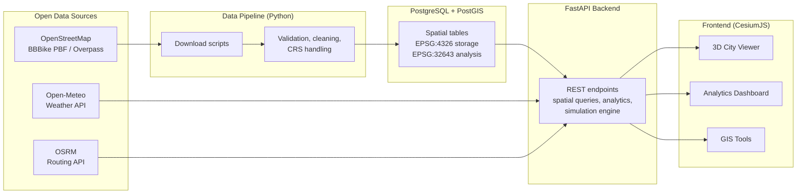

# Islamabad 3D Urban Intelligence Digital Twin

A web-based 3D geospatial digital twin for urban infrastructure visualization, spatial analysis, smart city monitoring, and decision support.


## Overview

This project adapts an open-source 3D city architecture into an urban-intelligence and public-service-accessibility dashboard for Islamabad, Pakistan. It combines a CesiumJS 3D city viewer, a PostGIS spatial database, a FastAPI backend, OpenStreetMap-derived infrastructure, live weather, routing, and reproducible spatial analysis.

**Study area:** Islamabad urban area and immediate peri-urban surroundings (approx. bounding box 72.80–73.25 E, 33.60–33.82 N).


## Problem Statement

Islamabad needs integrated spatial tools for exploring infrastructure distribution, emergency-service coverage, green-space accessibility, and mobility networks. This project demonstrates how a city-scale decision-support prototype can be built using open-source software and openly licensed data while documenting data-quality limitations.

## Objectives

1. Build an interactive 3D city model of Islamabad from OpenStreetMap data.
2. Design a professional PostGIS spatial database for urban infrastructure.
3. Implement server-side spatial analysis (nearest facility, coverage, accessibility, buffers).
4. Integrate real-time weather (Open-Meteo) and network routing (OSRM).
5. Provide a clearly-labelled digital twin simulation layer (traffic, parking, EV chargers).
6. Deliver an urban analytics dashboard with reproducible GIS methodology.

## Key Features

| Module | Description |
|---|---|
| 3D City Viewer | Extruded OSM buildings, roads, rail, water, land use; click-to-inspect attributes |
| Smart City Layers | 13+ toggleable infrastructure layers |
| Real-Time Weather | Open-Meteo current conditions dashboard card |
| Urban Mobility | Nearest facility search, distance analysis, OSRM routing |
| Emergency Response | Incident → nearest hospital/police/fire with optimal 3D route |
| Analytics Dashboard | Chart.js urban statistics from PostGIS |
| 3D Building Analysis | Height classification (low/medium/high-rise), density |
| Green Space Accessibility | Distance-to-park analysis, coverage indicators |
| Infrastructure Coverage | Buffer & nearest-neighbor analysis, underserved area detection |
| Digital Twin Simulation | Simulated traffic/parking/EV status (clearly labelled) |
| Time Visualization | CZML animated vehicles with timeline controls |
| Spatial Query Tool | PostGIS-powered interactive queries |
| Measurement Tools | 3D distance, area, and height measurement |

## Technology Stack

**Frontend:** CesiumJS, HTML5, CSS3, JavaScript (ES modules), Chart.js
**Backend:** Python 3.11+, FastAPI, psycopg 3, httpx
**Database:** PostgreSQL 15+ with PostGIS 3.4
**GIS:** QGIS (QA/visual verification), pyproj, shapely
**Data:** OpenStreetMap (Overpass API), Open-Meteo, OSRM, Natural Earth
**Deployment:** Docker Compose for local use; the tiers can also be deployed separately

## System Architecture



Full architecture documentation: [docs/ARCHITECTURE.md](docs/ARCHITECTURE.md)

## Repository Structure

```
smart-city-digital-twin/
├── backend/          # FastAPI application
│   └── app/
│       ├── core/     # config, database connection
│       ├── routers/  # API endpoints
│       ├── schemas/  # Pydantic response models
│       └── services/ # spatial analysis, simulation, external APIs
├── frontend/         # CesiumJS web application (static)
│   ├── css/
│   └── js/modules/   # viewer, layers, tools, dashboard modules
├── database/         # SQL schema, spatial queries, ER diagram
├── data/             # raw & processed datasets (gitignored, script-generated)
├── scripts/          # data acquisition & processing (Python)
├── docs/             # methodology, guides, diagrams
└── tests/            # backend unit/API tests, spatial validation
```

## GIS Analyses

All metric analysis uses **EPSG:32643 (WGS 84 / UTM zone 43N)** or exact WGS 84 geodesics — never planar math in degrees (validated by tests: UTM zone 43N planar vs geodesic agreement < 0.05 % across the study area). Implemented analyses: KNN nearest-facility with geodesic re-ranking · dissolved-buffer service coverage with underserved-area detection · metric-grid building density (MAUP-aware, user-selectable cell size) · green-space accessibility surfaces against the WHO 300 m proximity target · network routing & emergency response · height classification (low/mid/high-rise) · parameterised spatial queries. Full 7-point methodology per analysis: [docs/GIS_METHODOLOGY.md](docs/GIS_METHODOLOGY.md).

## Documentation

| Document | Contents |
|---|---|
| [INSTALLATION.md](docs/INSTALLATION.md) | Local setup: PostgreSQL/PostGIS, pipeline, backend, frontend |
| [USER_GUIDE.md](docs/USER_GUIDE.md) | Using every module of the application |
| [DEVELOPER_GUIDE.md](docs/DEVELOPER_GUIDE.md) | Architecture map, conventions, how to extend |
| [GIS_METHODOLOGY.md](docs/GIS_METHODOLOGY.md) | Formal methodology for each spatial analysis |
| [API_DOCUMENTATION.md](docs/API_DOCUMENTATION.md) | All 26 endpoints, parameters, error contract |
| [DATABASE.md](docs/DATABASE.md) | Schema, ER diagram, design rationale |
| [ARCHITECTURE.md](docs/ARCHITECTURE.md) | System & data-flow diagrams, key decisions |
| [DATA_SOURCES.md](docs/DATA_SOURCES.md) | Sources, licenses, attribution, quality notes |
| [DEPLOYMENT.md](docs/DEPLOYMENT.md) | GitHub Pages + Render free-tier deployment |
| [LIMITATIONS.md](docs/LIMITATIONS.md) | Honest account of trade-offs |
| [PORTFOLIO_DESCRIPTION.md](docs/PORTFOLIO_DESCRIPTION.md) | CV/LinkedIn-ready descriptions |

## Installation

### Windows quick start

1. Install and start Docker Desktop.
2. Double-click `START_ISLAMABAD_TWIN.bat`.
3. Open `http://localhost:8080` if the browser does not open automatically.

The launcher builds the CesiumJS frontend, FastAPI backend and PostGIS database,
loads the packaged Islamabad data, and starts the application. Use
`STOP_ISLAMABAD_TWIN.bat` to stop it while retaining the database volume.

See [docs/INSTALLATION.md](docs/INSTALLATION.md) for manual development setup.

## Data Sources & Attribution

| Source | Data | License |
|---|---|---|
| OpenStreetMap contributors | Buildings, roads, rail, facilities, water, land use | ODbL 1.0 |
| Open-Meteo | Current weather | CC BY 4.0, no key required |
| Project OSRM | Route calculation (demo server) | BSD 2-Clause |
| Natural Earth | Context layers | Public domain |

**Simulated data notice:** Traffic status, parking occupancy, and EV charger availability are *simulated for digital twin demonstration* and are labelled as such throughout the application. No official real-time feeds are misrepresented.

## Limitations

See [docs/LIMITATIONS.md](docs/LIMITATIONS.md). Headline items: OSM building heights are incomplete (levels-based estimation is documented), the OSRM demo server is rate-limited, and simulation layers are demonstrative only.

## Future Improvements

Integration of Sentinel-2 land cover classification, photogrammetric 3D Tiles, real IoT sensor feeds, and multi-city support.

## Attribution and adaptation

Original architecture: **Dilux Logeswaran**, released under the MIT licence.

## License

MIT — see [LICENSE](LICENSE).
