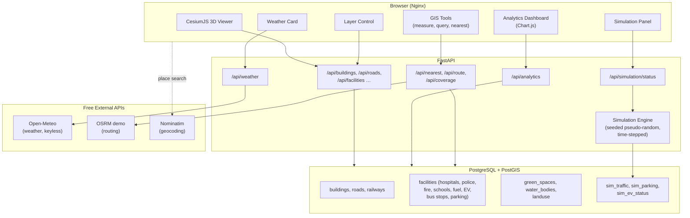
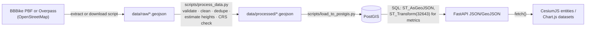

# System Architecture

## 1. Overview

The Smart City Digital Twin is a three-tier WebGIS:

1. **Data tier** — PostgreSQL 15 + PostGIS 3.4 storing OpenStreetMap-derived urban infrastructure for Islamabad, plus simulation state tables.
2. **Service tier** — FastAPI (Python 3.11) exposing spatial queries, analytics, routing, weather, and the digital twin simulation engine as a REST API.
3. **Presentation tier** — a static CesiumJS single-page application (HTML/CSS/ES-module JavaScript) rendering the 3D city and dashboards.

The packaged application runs locally with Docker Compose: Nginx serves the static frontend, FastAPI provides the API, and PostGIS stores spatial data. External services (Open-Meteo, OSRM demo, Nominatim) are free and keyless.

## 2. Architecture Diagram

## 3. Data Flow

## 4. Coordinate Reference Systems

| Purpose | CRS | EPSG | Rationale |
|---|---|---|---|
| Storage & web delivery | WGS 84 | 4326 | Native OSM/GeoJSON/Cesium CRS |
| Metric distance & area | WGS 84 / UTM zone 43N | 32643 | Appropriate projected CRS for Islamabad with low city-scale distortion |

**Rule:** metric computations are never performed on raw EPSG:4326 coordinates. Every distance/area/buffer in SQL wraps geometry in `ST_Transform(geom, 32643)`. Where geodesic results are preferable (e.g., long straight-line distances), `geography` casts are used instead. Each analysis documents its choice in `GIS_METHODOLOGY.md`.

## 5. Backend Design

- **Routers** (`app/routers/`) — thin HTTP layer, one module per domain (buildings, facilities, mobility, analytics, simulation, weather).
- **Services** (`app/services/`) — spatial SQL, simulation engine, external API clients. All SQL is parameterised (no string interpolation of user input).
- **Schemas** (`app/schemas/`) — Pydantic models validating every response; GeoJSON responses follow RFC 7946.
- **Core** (`app/core/`) — settings (pydantic-settings from `.env`) and a psycopg 3 connection pool opened/closed with the FastAPI lifespan.

Error strategy: database unavailability degrades to HTTP 503 with a JSON problem body; invalid parameters return 422 via Pydantic/FastAPI validation; external API failures return 502 with the upstream identified.

## 6. Frontend Design

Single-page app, no build step (portable, GitHub Pages friendly):

- `js/config.js` — deployment configuration (API URL, optional ion token, study-area constants).
- `js/app.js` — entry point wiring modules together.
- `js/modules/viewer.js` — Cesium initialisation, camera utilities.
- `js/modules/ui.js` — sidebar, search, status indicator.
- Later milestones add: `layers.js`, `buildings.js`, `weather.js`, `mobility.js`, `emergency.js`, `dashboard.js`, `simulation.js`, `timeviz.js`, `query.js`, `measure.js`, `analysis.js`.

CesiumJS and Chart.js load from CDN (pinned versions). The viewer runs key-free (OSM imagery, ellipsoid terrain); a free Cesium ion token optionally enables World Terrain.

## 7. Key Technical Decisions

| Decision | Choice | Reason |
|---|---|---|
| Building 3D | Extruded footprints (GeoJSON → Cesium polygon extrusion) | OSM has footprints + levels; avoids heavyweight 3D Tiles pipeline while remaining honest about data (heights estimated from `building:levels`, documented) |
| DB driver | psycopg 3 (sync + pool) | Simple, robust; workload is read-heavy short queries |
| Routing | OSRM public demo server, proxied by backend | Free network routing; proxy adds caching, rate-limit courtesy, and hides no secrets (none needed) |
| Weather | Open-Meteo | Free, keyless, CC BY 4.0 |
| Simulation | Server-side seeded time-stepped state in PostGIS tables | Deterministic-ish, honest labelling, survives restarts |
| Frontend build | None (plain ES modules) | Zero-dependency deploy to GitHub Pages |

## 8. Security

- No secrets in code; all configuration via environment variables (`.env`, gitignored; `.env.example` committed).
- CORS restricted to configured origins; API is read-only (GET) to the public.
- All spatial query parameters validated (type, range, bbox limits) before touching SQL; SQL always parameterised.
