# Database Documentation

PostgreSQL 15+ with PostGIS 3.4. Database name: `smart_city_twin`.

## Design Principles

1. **Storage CRS EPSG:4326** — native CRS of OSM, GeoJSON (RFC 7946) and CesiumJS; no client-side reprojection needed.
2. **Analysis CRS EPSG:32643** (WGS 84 / UTM zone 43N) — all metric buffers/distances/areas via `ST_Transform(geom, 32643)` or `geography` casts; never planar math in degrees.
3. **One facilities table, typed views** — nine facility classes share an identical shape; a single table with a `facility_type` check constraint plus per-type views (`v_hospitals`, `v_fire_stations`, …) avoids nine duplicate tables while keeping domain-specific access.
4. **Honest attribution** — estimated values carry a `*_source` column (`height_source`); simulation tables enforce `is_simulated = TRUE` with a fixed disclaimer via CHECK constraints, so demonstration data cannot masquerade as real telemetry.
5. **Natural keys preserved** — every OSM feature keeps `(osm_type, osm_id)` with a UNIQUE constraint; surrogate `BIGSERIAL` primary keys serve FKs.

## ER Diagram

```mermaid
erDiagram
    BUILDINGS {
        bigserial id PK
        text osm_type
        bigint osm_id
        text name
        text building_type
        int levels
        numeric height_m
        text height_source
        numeric footprint_area_m2
        geometry geom "MultiPolygon 4326"
    }
    ROADS {
        bigserial id PK
        bigint osm_id
        text highway
        boolean oneway
        numeric lanes
        numeric maxspeed
        numeric length_m
        geometry geom "MultiLineString 4326"
    }
    RAILWAYS {
        bigserial id PK
        bigint osm_id
        text railway
        numeric length_m
        geometry geom "MultiLineString 4326"
    }
    WATERWAYS {
        bigserial id PK
        text waterway
        geometry geom "MultiLineString 4326"
    }
    WATER_BODIES {
        bigserial id PK
        text natural
        numeric area_m2
        geometry geom "MultiPolygon 4326"
    }
    LANDUSE {
        bigserial id PK
        text landuse
        numeric area_m2
        geometry geom "MultiPolygon 4326"
    }
    GREEN_SPACES {
        bigserial id PK
        text leisure
        numeric area_m2
        geometry geom "MultiPolygon 4326"
    }
    FACILITIES {
        bigserial id PK
        bigint osm_id
        text facility_type "9 classes"
        text name
        numeric capacity
        numeric beds
        geometry geom "Point 4326"
    }
    SIM_TRAFFIC_STATUS {
        bigserial id PK
        bigint road_id FK
        text status "low-severe"
        numeric speed_factor
        boolean is_simulated "always TRUE"
        timestamptz updated_at
    }
    SIM_PARKING_STATUS {
        bigserial id PK
        bigint facility_id FK
        text status "available-full"
        numeric occupancy_pct
        boolean is_simulated "always TRUE"
    }
    SIM_EV_STATUS {
        bigserial id PK
        bigint facility_id FK
        text status "available-busy-offline"
        boolean is_simulated "always TRUE"
    }

    ROADS ||--o| SIM_TRAFFIC_STATUS : "road_id"
    FACILITIES ||--o| SIM_PARKING_STATUS : "facility_id (parking)"
    FACILITIES ||--o| SIM_EV_STATUS : "facility_id (ev_charging)"
```



## Tables

| Table | Geometry | Contents | Key constraints |
|---|---|---|---|
| `buildings` | MultiPolygon | OSM footprints, height (with source flag), levels, type | `UNIQUE(osm_type, osm_id)`, height 0–500 m, levels 1–200 |
| `roads` | MultiLineString | Highway network with class, lanes, maxspeed, oneway | `UNIQUE(osm_type, osm_id)` |
| `railways` | MultiLineString | Rail lines | — |
| `waterways` | MultiLineString | Rivers, canals, streams | — |
| `water_bodies` | MultiPolygon | Lakes, reservoirs (incl. Beira Lake) | — |
| `landuse` | MultiPolygon | Land-use polygons | — |
| `green_spaces` | MultiPolygon | Parks, gardens, playgrounds, forest, meadow | — |
| `facilities` | Point | 9 facility classes (centroid for polygon facilities) | `facility_type` CHECK, `UNIQUE(osm_type, osm_id, facility_type)` |
| `sim_traffic_status` | — | SIMULATED traffic per major road | FK→roads, status CHECK, `is_simulated` forced TRUE |
| `sim_parking_status` | — | SIMULATED occupancy per parking facility | FK→facilities, occupancy 0–100 |
| `sim_ev_status` | — | SIMULATED charger availability | FK→facilities |

## Indexes

GIST spatial indexes on all geometry columns; b-tree on `facilities.facility_type`, `roads.highway`, `buildings.building_type`, `buildings.height_m`, `landuse.landuse`, and simulation FK columns. See `database/schema/05_indexes.sql`.

## Setup

```bash
# Windows: use the SQL Shell (psql) or add PostgreSQL bin to PATH
psql -U postgres -f database/schema/00_create_database.sql
psql -U postgres -d smart_city_twin -f database/schema/01_extensions.sql
psql -U postgres -d smart_city_twin -f database/schema/02_tables.sql
psql -U postgres -d smart_city_twin -f database/schema/03_views.sql
psql -U postgres -d smart_city_twin -f database/schema/04_simulation.sql
psql -U postgres -d smart_city_twin -f database/schema/05_indexes.sql

# Load processed data + seed simulation
cd scripts
python load_to_postgis.py            # or: python load_to_postgis.py --apply-schema
```

## Verification queries

```sql
SELECT count(*), min(height_m), max(height_m) FROM buildings;
SELECT facility_type, count(*) FROM facilities GROUP BY 1 ORDER BY 2 DESC;
SELECT st_srid(geom), count(*) FROM buildings GROUP BY 1;   -- must be 4326 only
SELECT round(sum(length_m)/1000.0, 1) AS road_km FROM roads;
```

## Reusable analysis queries

`database/queries/` holds documented, parameterised SQL used by the API and reproducible in `psql`/QGIS: `nearest_facility.sql` (KNN + exact geodesic re-rank), `buildings_near_facility.sql` (metric `ST_DWithin`), `coverage_gaps.sql` (dissolved EPSG:32643 buffers, underserved share), `green_space_accessibility.sql`.
