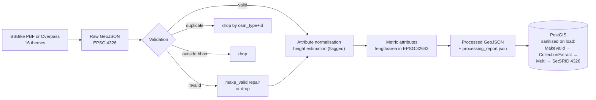

# GIS Methodology

Formal methodology for every spatial analysis in the Islamabad 3D Smart City Digital Twin. Each section follows the same structure: input datasets, preprocessing, CRS, GIS operation, method, output, and limitations.

## 0. Coordinate Reference Systems (applies to all analyses)

| Role | CRS | EPSG |
|---|---|---|
| Storage & web delivery | WGS 84 | 4326 |
| Metric analysis | WGS 84 / UTM zone 43N (Transverse Mercator) | 32643 |
| Long-distance / arbitrary-point distance | WGS 84 geography (geodesic) | 4326 (geography type) |

**Rule: metric quantities are never computed in geographic degrees.** Planar operations transform to EPSG:32643; point-to-feature distances use PostGIS `geography` (exact geodesics on the WGS 84 ellipsoid). Validation (`tests/spatial/test_crs.py`) shows UTM zone 43N planar distances agree with geodesics to **< 0.05 %** across the study area, and documents that degree-as-metre confusion would err by ~5 orders of magnitude.

Study area: Islamabad urban area and immediate peri-urban surroundings, approximate bounding box 72.80–73.25 E, 33.60–33.82 N (~42 × 24 km).

---

## 1. Building Height Estimation & 3D Extrusion

1. **Input:** OSM building footprints (`way`/`relation` with `building=*`), tags `height`, `building:levels`.
2. **Preprocessing:** geometry repair (`make_valid`), deduplication by `(osm_type, osm_id)`, bbox filter.
3. **CRS:** stored 4326; footprint area in 32643.
4. **Operation:** attribute derivation + polygon extrusion (CesiumJS).
5. **Method (documented decision rule):**
   - `height` tag parseable and plausible (2–400 m) → used directly, flagged `osm_height`;
   - else `building:levels` × **3.0 m/level** (standard mixed low-rise storey height), flagged `levels_x3`;
   - else **6.0 m default** (≈2 levels), flagged `default_assumed`.
6. **Output:** `height_m` + `height_source` per building; extruded 3D visualization.
7. **Limitations:** most Islamabad buildings lack height tags, so most heights are estimates; the 3.0 m/level factor ignores floor-use differences; flags make estimate provenance queryable and visible in the UI — estimates are never presented as measurements.

## 2. Building Height Classification (3D thematic mapping)

1. **Input:** `buildings.height_m`.
2. **Method:** fixed thresholds from urban-morphology convention — **low-rise < 12 m** (≤3–4 storeys), **mid-rise 12–30 m**, **high-rise > 30 m** (~10+ storeys). Fixed breaks (not quantiles) keep classes physically meaningful and stable across data updates; boundaries are inclusive upward (12 m → mid, 30 m → mid).
3. **Output:** colour-coded 3D buildings; class counts in analytics (classes partition the building set — tested).
4. **Limitations:** classification inherits height-estimation uncertainty; a mapped `levels=4` building (12.0 m) sits exactly on a boundary by construction of the 3.0 m factor.

## 3. Building Density Grid

1. **Input:** building footprints.
2. **CRS:** grid generated in EPSG:32643 → cells are true metric squares; results transformed back to 4326.
3. **Operation:** point-in-cell aggregation.
4. **Method:** building **centroids** are binned arithmetically — `floor((x − x₀)/cell)` — an exact O(n) equivalent of a centroid-in-cell spatial join. Default cell 250 m (user 100–1000 m). Mean `height_m` per cell accompanies the count as a built-up intensity proxy.
5. **Output:** GeoJSON choropleth; breaks ≤10 / 11–50 / 51–150 / >150 buildings per cell.
6. **Limitations:** centroid membership assigns boundary-straddling buildings to one cell; count ignores footprint size (mean height partially compensates); MAUP applies — cell size changes the picture, hence the user-selectable size.

## 4. Green-Space Accessibility

**(a) Point query:** nearest green space via KNN index pre-selection re-ranked by exact geodesic distance; counts/areas within radius via `ST_DWithin` on geography.

**(b) Accessibility grid:** for each 250 m cell (EPSG:32643), distance from centroid to nearest green-space polygon — KNN(5) candidates by index, then exact metric distance (distance 0 inside a green space). Bands follow the WHO-inspired **300 m** proximity target, then 600 m and 1 km: cells > 1 km are flagged poor-accessibility.

**Limitations:** straight-line distance, not walking-network distance — real access is longer where barriers (canals, rail, arterials) intervene; OSM green-space completeness varies; KNN(5) pre-selection is a documented performance compromise (a distant 6th polygon could theoretically be nearest — practically negligible at this feature density).

## 5. Infrastructure Coverage / Underserved Areas

1. **Input:** facility points (hospitals, fire, police, fuel, EV), building footprints.
2. **CRS:** EPSG:32643 throughout.
3. **Operation:** buffer → dissolve → point-in-polygon.
4. **Method:** `ST_Buffer` of radius r around each facility in 32643 (true metric buffers — never degree buffers), `ST_Union` dissolve, then building **centroids** tested with `ST_Intersects`. Underserved share = uncovered/total. Service area simplified (25 m tolerance) and returned for display.
5. **Output:** covered/underserved counts, percentage, service-area polygon. Monotonicity (larger radius ⇒ ≥ coverage) is unit-tested.
6. **Limitations:** Euclidean buffers approximate true response/travel range; all facilities weighted equally (a clinic counts like a national hospital); facilities just outside the bbox are absent (edge effect).

## 6. Nearest-Facility & Emergency Response Analysis

1. **Input:** facility points; user-selected origin; OSM road network (via OSRM).
2. **Method:** two-stage nearest search — index-accelerated KNN (`<->`) pre-selects 50 candidates, exact geography distance re-ranks (KNN degree-ordering alone would be slightly biased anisotropically). Network routes from the public OSRM demo server (`/route/v1/driving`, GeoJSON geometry); straight-line via geodesic. Emergency module routes **facility → incident** (response direction) for hospital, police, fire in parallel.
3. **Output:** ranked facilities (distance-sorted — tested), route geometry, road distance, estimated time.
4. **Limitations:** OSRM demo durations are **free-flow** (no live traffic — the simulated traffic layer is display-only and never feeds routing); demo server is rate-limited, no SLA; driving profile only (no pedestrian/emergency profiles).

## 7. Spatial Query Tool

Parameterised PostGIS templates: buildings within r of a facility type (`ST_DWithin` geography join, DISTINCT); facilities within r of a point; facilities within r of major roads (`highway ∈ {motorway, trunk, primary, secondary}` via EXISTS). All inputs validated and parameterised (no SQL injection path); result caps documented per endpoint.

## 8. Measurement Tools

- **Distance:** vertex-to-vertex **geodesics** on the WGS 84 ellipsoid (`EllipsoidGeodesic`). Surface path; terrain height ignored (no terrain by default).
- **Area:** vertices projected to a local tangent plane (equirectangular about the first vertex), shoelace formula. Validated < 1 % error on a 1 km² square; at city scale error is negligible, at larger extents use proper projection.
- **Height:** reports the picked building's `height_m` **attribute with its source flag**. The app has no photogrammetric surface, so a scene-based "measurement" would fabricate accuracy — the tool says so explicitly.

## 9. Digital Twin Simulation (methodological honesty)

Traffic/parking/EV states are generated by a seeded, bounded Markov-style process (states move at most one level per tick, 60 s interval). Every row carries `is_simulated = TRUE` (enforced by CHECK constraint) and the disclaimer *"Simulated for Digital Twin Demonstration"*; the UI repeats the warning on panels and popups. Simulated values never feed analytical results (routing, coverage, analytics).

## 10. Data Processing Workflow

